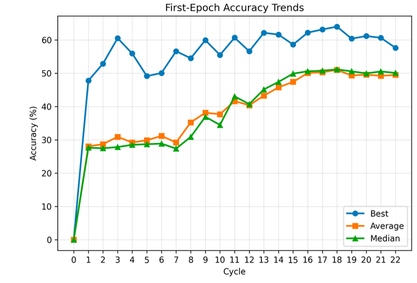

## General requirement: modify the code and generate a diagram as shown in the picture.

## Explanation of the image:

In general, it is the performance of vision model on CIFAR-10 generated language model across epochs.

Each cycle the language model will generate multiple vision models as implemented in nn_gen, and
1. You should evaluate the correctness of the generated code, 
2. then you should train the model filtered by previous step on CIFAR-10 data set by one epoch,
3. Evaluate the models accuracy on the test set, thank you will get a list of accuracy values of different models.
4. Calculate the average accuracy, median accuracy, and the best accuracy.
5. Plot the line of these three kinds of accuracies across 22 epoches.

## General pipeline of your task

1. [coding point]: At first you should run the language model to generate vision models with nn_gen, and the function will automatically save the code into lemur dataset.
2. [coding point]: After saving the code into lemur dataset, you should call nn-dup to create a high-quality data set. 
3. [coding point]: The output of nn-dup may be several jsonl files, so you should use the file to build data set and the train the model with QLoRA.

[coding point]: Step one to step three is the working of one epoch and  we should repeat several epochs.

## Other requirements

- Position of saving code requirement: you should save the code in a single python file in nn-gpt/ab/gpt/
- Tip: try to utilise the module implemented in the repository, but the code should be easily understandable.
- the language model is gpt-oss-20b, as defined in nn-gpt/ab/gpt/conf/llm/gpt_oss_20b.json